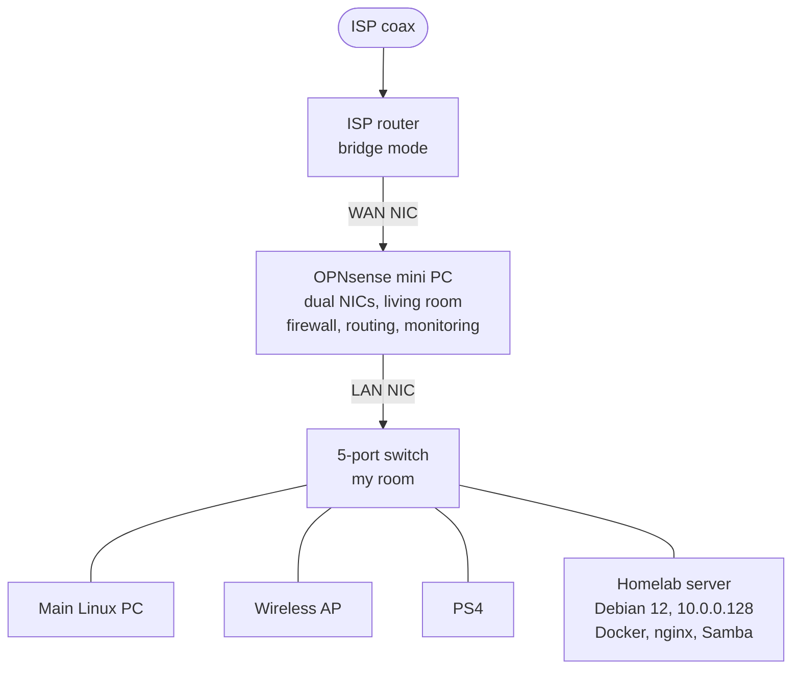

# homelab

A self-hosted network and server stack I designed, built, and maintain at home: a custom OPNsense router, a Debian server running about a dozen containerized services, and a NAS for my media. Everything in this repo is sanitized (no secrets, no public hostnames), so it is safe to read and reuse.

## Why I built it

Most of what people use online is rented from a handful of companies that can change the terms, raise prices, mine the data, or shut a service down. I wanted to see how much of that I could run myself.

- **Control and privacy.** My photos, passwords, and files live on hardware I own, behind a firewall I configured.
- **Longevity.** My media library, especially my FLAC collection, should not disappear because a subscription lapsed or a platform folded.
- **Skills.** Running real infrastructure (routing, firewalling, containers, monitoring, backups) teaches things tutorials don't, mostly by breaking.

## Architecture



- **Edge:** the ISP router runs in bridge mode, so the OPNsense box is the only router and firewall (no double NAT, one place for policy).
- **Internet access to my services:** through a Cloudflare Zero Trust tunnel, so no inbound ports are opened on the router.
- **Private remote access:** Tailscale.
- **Details:** [network/README.md](network/README.md) has addressing, cabling, and the remote-access flow.

## What it runs

| Service | Purpose |
|---|---|
| Immich | Photo and video library (self-hosted Google Photos replacement) |
| Jellyfin | Video streaming |
| Navidrome | Music streaming for my FLAC library |
| Vaultwarden | Password manager (Bitwarden-compatible) |
| Pi-hole | Network-wide DNS filtering |
| Uptime Kuma | Service uptime monitoring |
| Homarr | Dashboard for everything above |
| Portainer | Container management UI |
| Crafty Controller | Minecraft server management |
| CasaOS | Home-server dashboard and app manager |
| Samba | NAS on a dedicated 4 TB disk, single authenticated user |
| nginx | Personal websites and reverse proxying |
| SearXNG | Private metasearch engine |
| Ollama | Local LLM runtime (host service, localhost only) |
| Cloudflare Tunnel + Access | Outbound-only public access; admin apps and SSH sit behind identity policies |
| Tailscale | Private, encrypted remote access to the server |

Compose files and per-service notes: [docker/README.md](docker/README.md).

## Hardware

| Role | Hardware |
|---|---|
| Server | Dell Precision T3500, Xeon W3565 @ 3.2 GHz, 12 GB RAM, 477 GB boot disk, 4 TB data disk, Debian 12 |
| Router | AWOW AK34 mini PC (Intel Celeron J3455, 4 cores), two NICs, running OPNsense |
| Switching | TP-Link TL-SG105 unmanaged 5-port switch, TP-Link TL-WA801N access point |

More in [docs/hardware.md](docs/hardware.md).

## Problems I've fixed

**Troubleshooting blind when remote access was down.** The server's original Quadro 5000 had no output that matched the HDMI monitor I keep for testing. Whenever remote access failed, getting a local screen was a chore, so every outage took longer to diagnose than it should have. I swapped in a GeForce GT 1030, which has an HDMI port, so I can plug in and see what the machine is doing in seconds. Lesson: out-of-band access is part of the system design, not an afterthought.

**Power supply failure.** One day the server wouldn't start and the power button kept blinking orange. I looked up the blink pattern, which pointed to a failed power supply, swapped in a new standard 600 W ATX unit, and it came straight back. Write-up in [docs/troubleshooting.md](docs/troubleshooting.md).

## Security

Layers, an honest audit of my own setup, and the hardening roadmap are in [docs/security.md](docs/security.md).

## Repo layout

```
homelab/
├── docker/        compose files + README per service (sanitized)
├── nginx/         site and proxy configs (sanitized)
├── network/       topology, addressing, cabling, remote access
├── systemd/       host service units (tunnel, Ollama), tokens removed
├── docs/          hardware, security, storage, troubleshooting
└── scripts/       helper to copy configs off the server and scrub secrets
```

## Using the configs

Real secrets never live in this repo. Each service that needs them ships a `.env.example` with placeholder values. Copy it to `.env`, fill it in, then `docker compose up -d`.
