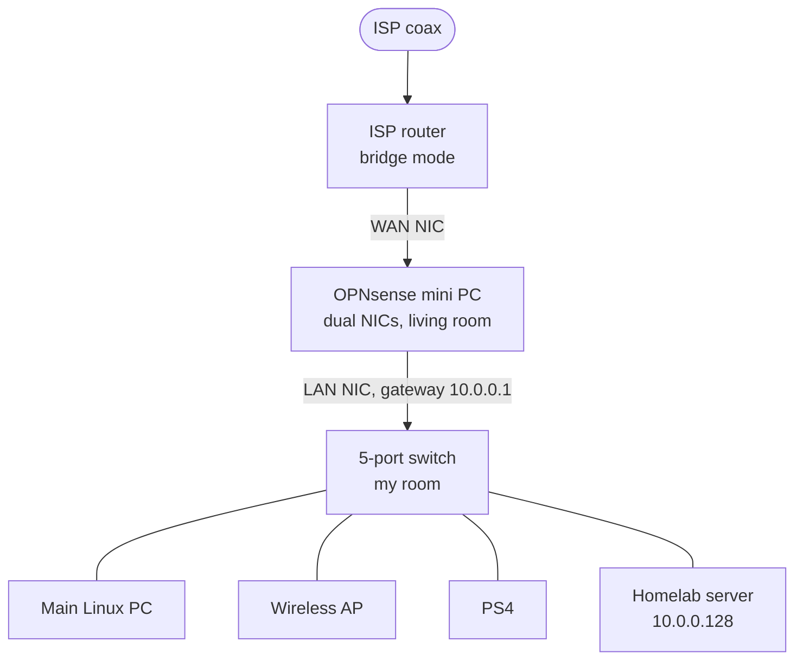
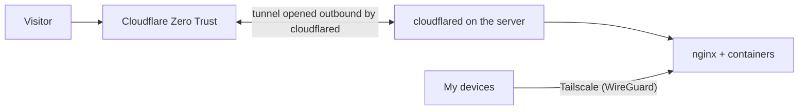

# Network

## Topology

## Cabling

| From | To |
|---|---|
| Coax from street | ISP router (bridge mode) |
| ISP router | OPNsense mini PC, WAN NIC |
| OPNsense mini PC, LAN NIC | 5-port switch (uplink) |
| Switch | Main Linux PC |
| Switch | Wireless access point |
| Switch | PS4 |
| Switch | Homelab server |

All five switch ports are in use: one uplink and four devices.

## Addressing

| Network | Range | Purpose |
|---|---|---|
| LAN | `10.0.0.0/24`, gateway `10.0.0.1` | PCs, server, Wi-Fi clients |
| Docker bridges | `172.17-172.31.0.0/16`, `192.168.208.0/20` | One per compose project, internal to the server |
| Tailscale | `100.64.0.0/10` (CGNAT range) | Private remote access |

## Why this design

- **Bridge mode on the ISP router.** Avoids double NAT and makes OPNsense the single place where firewall policy lives.
- **Dedicated router box with two NICs.** Separates WAN and LAN physically, and I can update or rebuild the firewall without touching the server.
- **OPNsense.** Open-source, fully configurable, and gives me traffic visibility that an ISP router never would.

## Remote access

The tunnel connection is initiated from inside my network, so the router has no port forwards for these services. Admin surfaces (Portainer and SSH) sit behind Cloudflare Access identity policies. My own devices can skip the public path and use Tailscale, a WireGuard-based mesh VPN.

## Monitoring

OPNsense's built-in monitoring watches traffic at the edge; Uptime Kuma watches each service.

<!-- TODO: name the specific OPNsense monitoring features you use (e.g. Insight/NetFlow, firewall logs, alerts). -->

## Next

VLAN segmentation (trusted / IoT and consoles / guests). The current switch is unmanaged, so this needs a VLAN-capable managed switch. See [docs/security.md](../docs/security.md).
